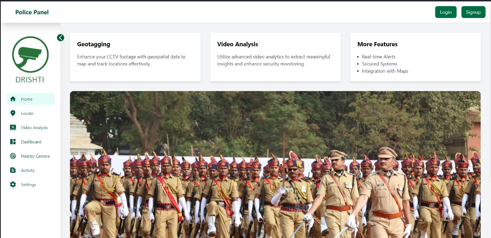
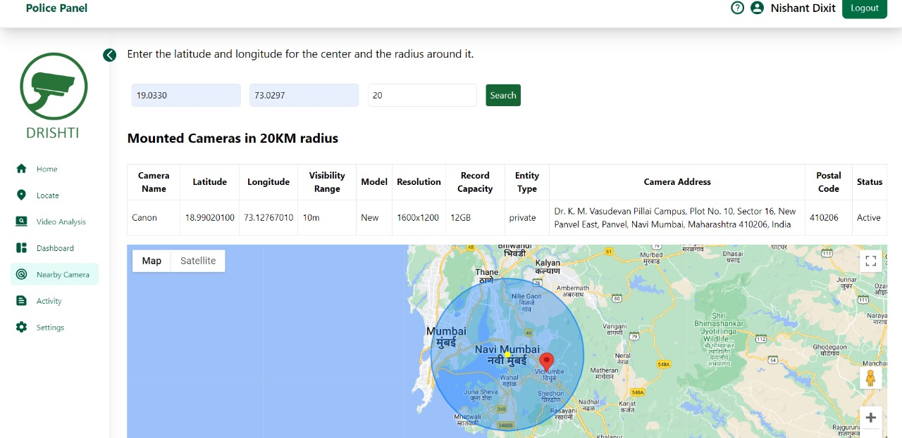
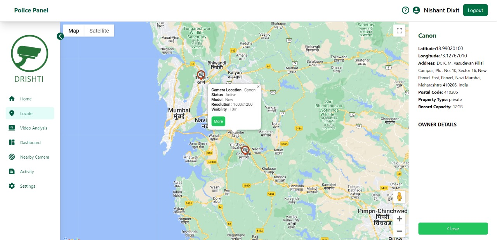
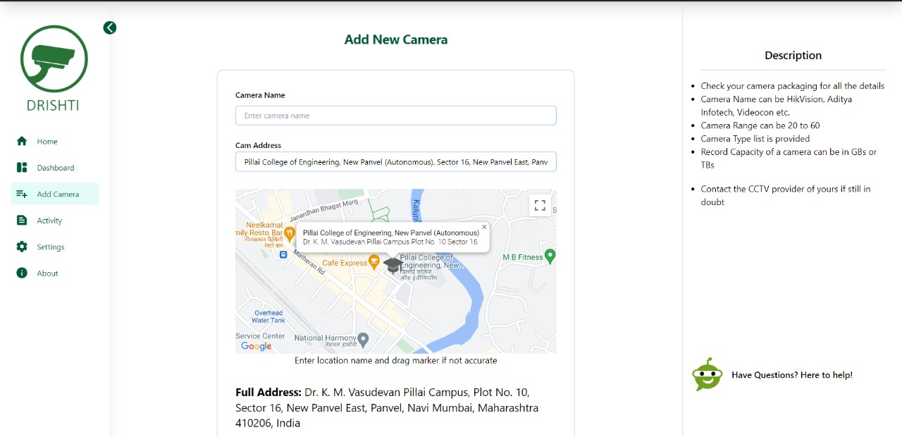
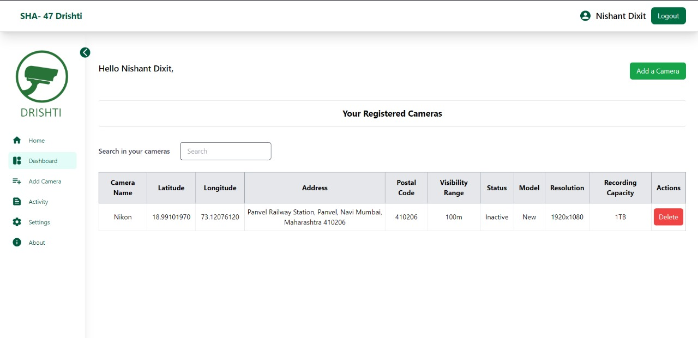

# SHA-47 Geo-Tagging System - Drishti

## Hackoverflow 2.0 Project

Team SHA-47 Geo-Tagging System named - Drishti, developed for the Hackoverflow 2.0. This comprehensive system aims to enhance public safety and streamline law enforcement efforts by geo-tagging privately owned surveillance cameras.

## Problem Statement

### Overview

In response to incidents, police traditionally expend resources to manually locate and verify CCTV cameras, a costly and labor-intensive process. The SHA-47 Geo-Tagging System streamlines this effort with a user-friendly interface, standardized metadata, and secure data storage, facilitating efficient camera management. Its integration with existing surveillance networks enables rapid retrieval and maintenance of cameras, potentially resolving multiple issues beyond specific incidents.

Here are some project snapshots -

### Police Interface 




### Camer Owner Interface 





### Challenges

1. **Private Cameras List Maintenance:**
   - Lack of a centralized and maintained list of private cameras.

2. **Camera Health Checks:**
   - Need to check the functionality of each camera and trigger notifications for repairs.

3. **Data Processing for Investigations:**
   - Analyzing hours of recorded footage to find specific incidents or objects.

## Solution

### Key Features

1. **Geographical Mapping:**
   - User-friendly interface for camera owners to input precise coordinates.

2. **Standardized Metadata:**
   - Metadata format for camera specifications, owner details, and visibility range.

3. **Secure Data Storage:**
   - Robust data security measures to protect privacy and confidentiality.

4. **Law Enforcement Access:**
   - Facilitates access to geo-tagged database for criminal investigations.

5. **Camera Checks:**
   - Automated notifications for camera functionality.

6. **Video Processing:**
   - AI and ML for object identification and crowd analysis.

## Implementation Details

## How to Run 

   Clone the project

```bash
  git clone https://github.com/nishaaannnt/hackoverflow-sha47.git
```

Go to the project directory

```bash
  cd hackoverflow-sha47
```

 - There are two folder -> client and server

 ### 1.  For client  
 - client has 2 folders policeclient and camclient
 - In both these folders run the following command

Install dependencies

```bash
  npm install
```
Run them locally 

```bash
  npm run dev
```

 ### 2.  For Server 

Install dependencies

 ```bash
  npm install
```
Run them locally 

```bash
  nodemon index.js
  #or 
  node index.js
```

### Note - 
1. You need to create a postgres Database with all the fields and tables provided in ``` server/src/ml_models/db ```

2. Also you need to configure your .env accordingly with PostgreSQL information and Google Maps API key.

### Technology Stack

- **Frontend:** ReactJS, TailwindCSS, Toastify
- **Backend/API:** ExpressJS, NodeJS
- **Database:** PostgreSQL
- **Maps API:** Google Maps 
- **Video Processing:** OpenCV, Tensorflow,YOLOv8


### By Team SHA-47

1. Shreeyash Kamble
2. Nishant Dixit
3. Sahil Sasane
4. Om Bothre

