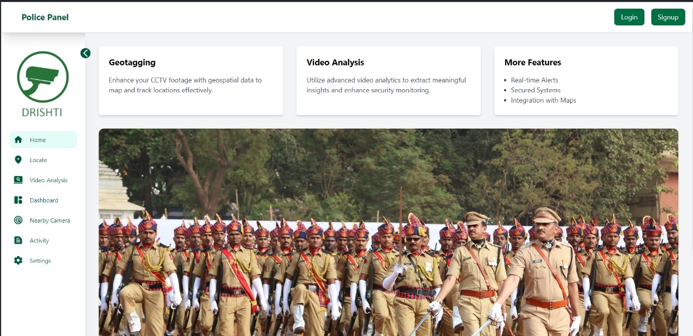
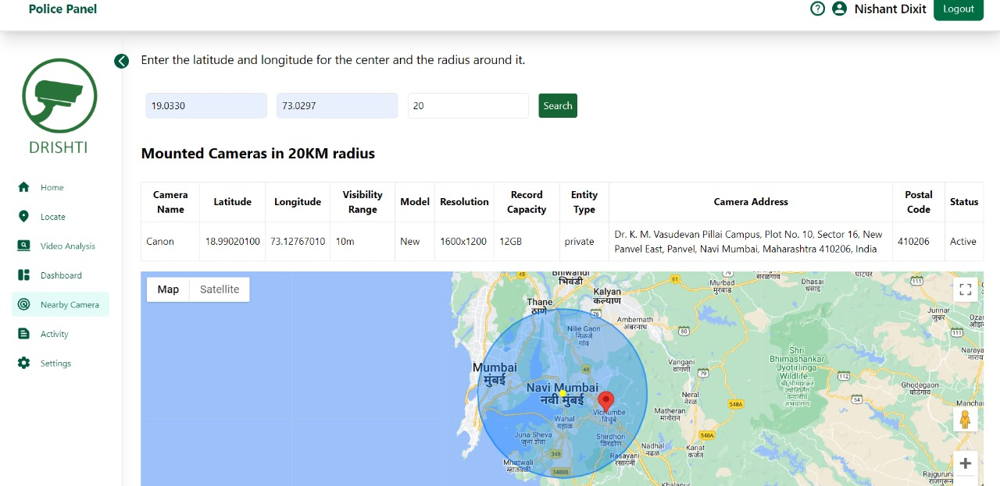
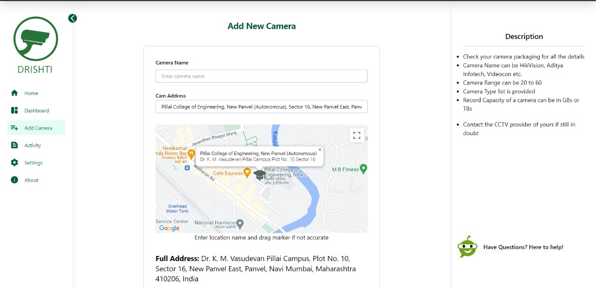

# SHA-47 Geo-Tagging System

## Hackoverflow 2.0 Project

Team SHA-47 Geo-Tagging System, developed for the Hackoverflow 2.0. This comprehensive system aims to enhance public safety and streamline law enforcement efforts by geo-tagging privately owned surveillance cameras.

## Problem Statement

### Overview

Private surveillance cameras are crucial for public safety, but the lack of standardized geo-tagging poses challenges for law enforcement. The SHA-47 Geo-Tagging System addresses these issues by providing a user-friendly interface for camera owners, standardized metadata, secure data storage, and seamless integration with existing surveillance networks.

Here are some project snapshots -

### Police Interface 

### Camer Owner Interface 

### Challenges

1. **Private Cameras List Maintenance:**
   - Lack of a centralized and maintained list of private cameras.

2. **Camera Health Checks:**
   - Need to check the functionality of each camera and trigger notifications for repairs.

3. **Data Processing for Investigations:**
   - Analyzing hours of recorded footage to find specific incidents or objects.

## Solution

### Key Features

1. **Geographical Mapping:**
   - User-friendly interface for camera owners to input precise coordinates.

2. **Standardized Metadata:**
   - Metadata format for camera specifications, owner details, and visibility range.

3. **Secure Data Storage:**
   - Robust data security measures to protect privacy and confidentiality.

4. **Law Enforcement Access:**
   - Facilitates access to geo-tagged database for criminal investigations.

5. **Camera Checks:**
   - Automated notifications for camera functionality.

6. **Video Processing:**
   - AI and ML for object identification and crowd analysis.

## Implementation Details

### Technology Stack

- **Frontend:** ReactJS, TailwindCSS, Toastify
- **Backend/API:** ExpressJS, NodeJS
- **Database:** PostgreSQL
- **Maps API:** Google Maps 
- **Video Processing:** OpenCV, Tensorflow,YOLOv8

### By Team SHA-47

1. Shreeyash Kamble
2. Nishant Dixit
3. Sahil Sasane
4. Om Bothre

